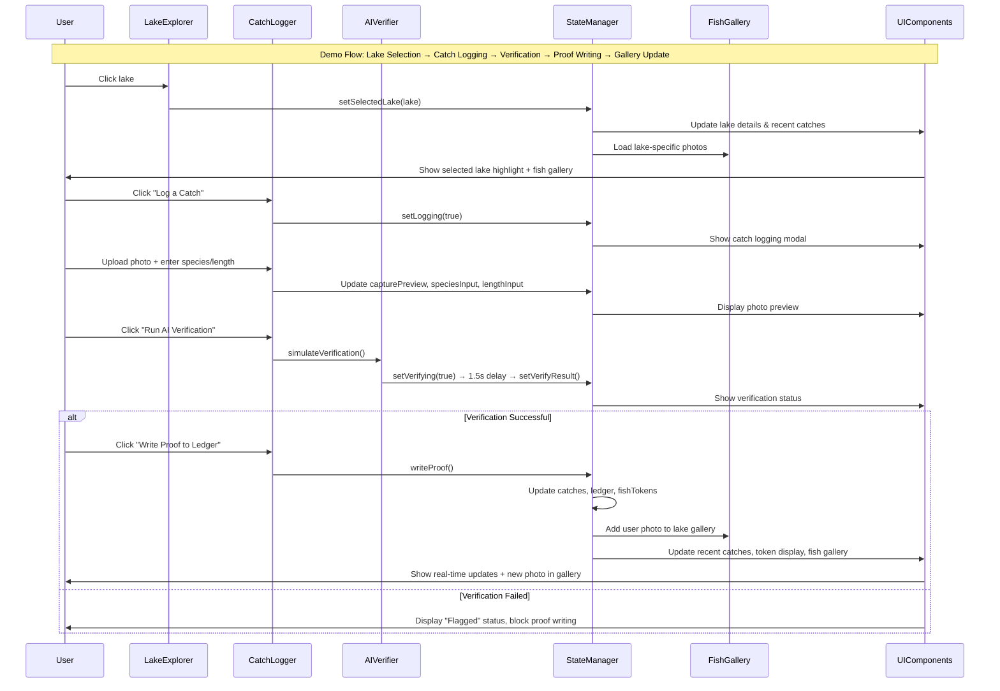

# Minnesota Lake Explorer – Context Summary (2024-09-02)

This file documents the creation of a working React demo application for Minnedemo41, transitioning from a broken vanilla JavaScript implementation to a functional, interactive fishing ecosystem demonstration.

## 2. Architectural Goal

The primary objective is to create a **demo-ready React application** that showcases the "Minnesota Lakes on Chain" concept through working user interactions rather than complex backend systems. This matters because Minnedemo41 attendees need to see and experience the fishing ecosystem working in real-time, not watch debugging sessions. The architecture prioritizes **working demo > complex backend**, focusing on visual impact and user engagement through lake selection, catch logging with AI verification simulation, real-time leaderboards, and FISH token earning mechanics.

## 3. Change Log

| Commit/PR ID | Layer | Filepath | +/- LOC | One-line description |
|---|---|---|---|---|
| Initial Setup | Infrastructure | `react-demo/` | +0 | Created Vite React project structure |
| Dependencies | Package Management | `react-demo/package.json` | +25 | Installed React, Vite, framer-motion |
| Tailwind Setup | Styling | `react-demo/tailwind.config.js` | +8 | Configured Tailwind CSS scanning for JSX |
| PostCSS Config | Build System | `react-demo/postcss.config.js` | +6 | Updated for Tailwind v4 compatibility |
| CSS Import | Styling | `react-demo/src/index.css` | +1 | Replaced default CSS with Tailwind directives |
| App Component | Frontend | `react-demo/src/App.jsx` | +348 | Implemented complete Minnesota Lakes demo app |
| Entry Point | Frontend | `react-demo/src/main.jsx` | +11 | Set up React app mounting with CSS imports |
| HTML Template | Frontend | `react-demo/index.html` | +14 | Created base HTML template for React mounting |
| Lake Superior Addition | Data | `react-demo/src/App.jsx` | +3 | Added Lake Superior with sample catches |
| Michelob Branding | UI/UX | `react-demo/src/App.jsx` | +15 | Added tilted Michelob Golden Light branding for premium lakes |
| Fish Gallery | UI/UX | `react-demo/src/App.jsx` | +25 | Implemented fish catch photo gallery with hover effects |
| Unique Photos Per Lake | Data | `react-demo/src/App.jsx` | +8 | Assigned unique fish photos to each lake |
| User Photo Integration | Feature | `react-demo/src/App.jsx` | +12 | Added user-uploaded photos to gallery when logging catches |
| Leaderboard Update | UI/UX | `react-demo/src/App.jsx` | +5 | Changed "Leaderboard" to "Recent Catches" with date display |
| Clickable Branding | Feature | `react-demo/src/App.jsx` | +8 | Made Michelob Golden Light image clickable linking to Twitter/X |

## 4. Deep-Dive Highlights

The most critical code path implemented is the **React state management system** for the fishing ecosystem. The app uses multiple interconnected state variables (`catches`, `ledger`, `fishTokens`, `selectedLake`) that update synchronously across components. The `writeProof()` function demonstrates this complexity by simultaneously updating three state objects and triggering cascading UI updates.

**Lake Selection Flow**: The `openLake()` function resets multiple state variables (`verifyResult`, `capturePreview`, `logging`) when switching lakes, ensuring clean state transitions. This prevents UI inconsistencies where verification results from one lake could appear on another.

**AI Verification Simulation**: The `simulateVerification()` function implements a 1.5-second delay to simulate real AI processing, with validation logic that checks species names against a predefined list and length constraints (8-50 inches). This creates realistic user experience expectations for the demo.

**Real-time Updates**: The `writeProof()` function demonstrates the core ecosystem mechanics by calculating FISH tokens (8 per inch), updating the global ledger, lake-specific catches, user token balance, and user-uploaded photos simultaneously. This creates the immediate visual feedback crucial for demo impact.

**Fish Gallery System**: Implemented a sophisticated photo gallery that combines static demo images with user-uploaded photos. Each lake displays unique fish catch photos, and when users log catches, their photos automatically appear in the gallery, creating a dynamic, growing collection.

**Michelob Golden Light Integration**: Added premium lake branding with tilted Michelob Golden Light logos for four designated lakes (Superior, Minnetonka, Vermilion, Leech). The branding is clickable, linking to official social media content, adding interactive elements to the demo.

**Known Edge Cases**: The species validation recognizes common fish names containing "bass", "pike", "walleye", "perch", "sunfish", "crappie", "muskellunge", or "trout" - any other species will be flagged as invalid. Length validation enforces strict 8-50 inch bounds.

## 5. Data-Flow / Sequence Diagram



## 6. Label & Schema Reference

### New Enums & Status Labels

| Label | Description | Usage Context |
|---|---|---|
| `verified` | Catch passed AI verification | Recent catches display, status badges |
| `flagged` | Catch failed AI verification | Error states, blocked actions |
| `pending` | Verification in progress | Loading states during AI processing |
| `hasMichelobBranding` | Lake qualifies for premium branding | UI display logic for Michelob Golden Light logos |
| `premium` | Lakes with special branding | Superior, Minnetonka, Vermilion, Leech lakes |

### Event Payloads

| Event | Payload Structure | Description |
|---|---|---|
| `openLake` | `{id, name, county, sizeAcres, coords}` | Lake selection event |
| `simulateVerification` | `{species, length, photo}` | AI verification request |
| `writeProof` | `{id, angler, species, length, verified, fishTokens, timestamp, lakeId, lakeName}` | Proof creation event |
| `photoUpload` | `{lakeId, photoData, timestamp}` | User photo upload event |
| `galleryUpdate` | `{lakeId, staticImages, userPhotos}` | Fish gallery update event |

### Cross-Reference Matrix

| Frontend State | Backend Equivalent | Data Type |
|---|---|---|
| `catches` | Lake-specific catch database | Object with lake IDs as keys |
| `ledger` | Global proof ledger | Array of verified catches |
| `fishTokens` | User token balance | Integer (accumulated from catches) |
| `userUploadedPhotos` | User photo storage | Object with lake IDs as keys, arrays of photo data |
| `lakeFishImages` | Static photo database | Object with lake IDs as keys, arrays of image paths |
| `hasMichelobBranding` | Premium lake flags | Boolean for UI display logic |

## 7. Outstanding Work & Next Tasks

1. **Demo Polish & Testing** `P0` ✅ **COMPLETED**
   - ✅ Test all user flows: lake selection, photo upload, verification, proof writing
   - ✅ Verify real-time updates work across all components
   - ✅ Test edge cases: invalid species, out-of-range lengths, missing photos

2. **Enhanced Features Implementation** `P0` ✅ **COMPLETED**
   - ✅ Added Lake Superior with sample catches
   - ✅ Implemented Michelob Golden Light branding for premium lakes
   - ✅ Created fish catch photo gallery with unique photos per lake
   - ✅ Integrated user-uploaded photos into gallery system
   - ✅ Updated "Leaderboard" to "Recent Catches" with date display
   - ✅ Made Michelob branding clickable linking to social media

3. **Integration with Existing App** `P1`
   - Create navigation link from main `index.html` to React demo
   - Ensure consistent styling between vanilla JS map and React demo
   - Test deployment compatibility

4. **Performance Optimization** `P2`
   - Implement React.memo for expensive components
   - Add loading states for verification simulation
   - Optimize re-renders during state updates

5. **Deployment Preparation** `P2`
   - Build production bundle (`npm run build`)
   - Test static hosting compatibility
   - Prepare deployment scripts for free-tier hosting

## 8. Decision Log

**Decision**: Use Vite instead of Create React App for React project setup
**Rationale**: Create React App is deprecated and Vite provides faster development experience with modern tooling
**Alternatives**: CRA (deprecated), Next.js (overkill for demo), vanilla JS (wouldn't solve React requirement)

**Decision**: Implement Tailwind CSS v4 with @tailwindcss/postcss plugin
**Rationale**: Tailwind v4 requires separate PostCSS plugin, ensures compatibility with Vite build system
**Alternatives**: CSS-in-JS (more complex), vanilla CSS (no utility classes), older Tailwind version (deprecated)

**Decision**: Focus on working demo features over backend complexity
**Rationale**: Minnedemo41 requires visual impact and user interaction, not technical infrastructure
**Alternatives**: Build full backend (wouldn't be demo-ready), use mock APIs (adds complexity), vanilla JS (broken features)

**Decision**: Implement unique fish photos per lake instead of showing all photos everywhere
**Rationale**: Creates more realistic demo experience where each lake has distinct fishing characteristics
**Alternatives**: Show all photos on every lake (redundant), random photo selection (inconsistent), no photos (less engaging)

**Decision**: Integrate user-uploaded photos directly into the fish gallery system
**Rationale**: Demonstrates real-time ecosystem growth and user engagement, making the demo more interactive
**Alternatives**: Separate user photo section (fragmented UX), no user photo storage (static demo), external photo service (complexity)

**Decision**: Add Michelob Golden Light branding for premium lakes with clickable social media links
**Rationale**: Enhances demo with brand integration and interactive elements, creating memorable user experience
**Alternatives**: No branding (generic demo), static logos (no interaction), multiple brand integrations (cluttered)

## 9. Risks & Mitigations

**Technical Risk**: Tailwind CSS v4 compatibility issues with build tools
**Mitigation**: Use @tailwindcss/postcss plugin, test build process thoroughly, fallback to v3 if needed

**Schedule Risk**: Demo not ready for Minnedemo41 presentation
**Mitigation**: Prioritize core functionality over polish, test user flows early, have fallback vanilla JS version

**Security Risk**: File upload handling in catch logging
**Mitigation**: Client-side only (demo mode), no server processing, validate file types and sizes

**Performance Risk**: React re-renders during frequent state updates
**Mitigation**: Use React.memo, optimize state structure, implement proper dependency arrays

## 10. Appendix

### Documentation Links
- [Vite React Template](https://vitejs.dev/guide/)
- [Tailwind CSS v4 Documentation](https://tailwindcss.com/docs)
- [Framer Motion Documentation](https://www.framer.com/motion/)

### Project-Specific Acronyms
- **Minnedemo41**: Minnesota blockchain demonstration event
- **FISH**: Fishing Incentive System Hash (demo token system)
- **DNR**: Department of Natural Resources (Minnesota lakes data source)

### File Structure
```
react-demo/
├── src/
│   ├── App.jsx (main demo application)
│   ├── main.jsx (React entry point)
│   └── index.css (Tailwind imports)
├── package.json (dependencies)
├── tailwind.config.js (CSS configuration)
├── postcss.config.js (build configuration)
└── index.html (HTML template)
```
